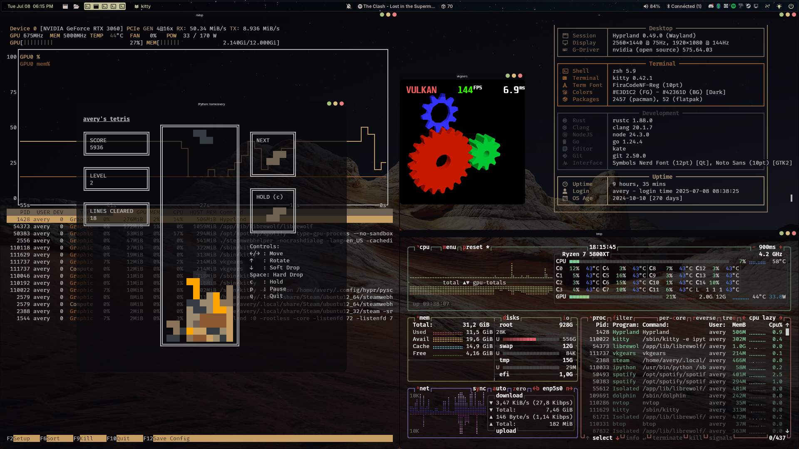

---

## About This Setup

This repository contains my personal dotfiles. They are primarily built for a setup using the [Hyprland](https://hyprland.org/) Wayland compositor. The configuration aims for a clean, functional, and aesthetically pleasing desktop environment.

These dotfiles began as a fork of the [ml4w dots](https://github.com/ml4w) but have since been heavily modified to suit my own workflow and preferences.

We are using UWSM.

---

## Hyprland

The core of this setup is the [Hyprland](https://hyprland.org/) Wayland compositor. The configuration is tailored for a multi-monitor setup and leverages `pywal` for dynamic color schemes based on the current wallpaper. It uses the `hy3` layout manager for tiling and includes several plugins for enhanced functionality:

* **hyprbars**: For window title bars.
* **hyprexpo**: For a workspace overview.
* **hy3**: For automatic tiling.

---

## Keybindings

| Keybinding | Action | Description |
| --- | --- | --- |
|Right Click|Notifications|Open Hyprpanel Settings|
|Right Click|Bluetooth|Open blueman-manager|
|Right Click|Sound|Open Pavucontrol|
| `CTRL` + `ALT` + `delete` | `exec` | Kill.  Left click to kill |
| `ALT` + `tab` | `hyprexpo:expo` | Toggle expo view |
| `SUPER` + `T` | `exec` | Open terminal |
| `SUPER` + `ALT` + `T` | `exec` | Open terminal with tetris |
| `SUPER` + `C` | `exec` | Start Ollama |
| `SUPER` + `B` | `exec` | Launch Librewolf browser |
| `SUPER` + `E` | `exec` | Open file manager (Dolphin) |
| `SUPER` + `CTRL` + `E` | `exec` | Open emoji picker |
| `SUPER` + `SPACE` | `exec` | Open application launcher (Rofi) |
| `SUPER` + `ESCAPE` | `exec` | Open Mission Center |
| `SUPER` + `K` | `exec` | Open Kate editor |
| `SUPER` + `Y` | `exec` | Open Zed code editor |
| `SUPER` + `M` | `movetoworkspacesilent`| Move to an empty workspace |
| `SUPER` + `U` | `exec` | Open Obsidian |
| `SUPER` + `Q` | `closewindow` | Close active window |
| `SUPER` + `ALT_R` + `Q`| `killactive` | Force kill active window |
| `SUPER` + `F` | `fullscreenstate` | Toggle fullscreen |
| `SUPER` + `G` | `togglefloating` | Toggle floating for active window |
| `SUPER` + `A` | `exec` | Take a region screenshot |
| `SUPER` + `P` | `exec` | Take screenshot of DP-1 |
| `SUPER` +  `ALT`  + `P` | `exec` | Take screenshot of DP-2 |
| `SUPER` + `CTRL`+ `G` | `exec` | Toggle floating for all windows on a workspace |
| `SUPER` + `SHIFT`+ `Z` | `swapsplit` | Swap split |
| `SUPER` + `Z` | `togglesplit` | Toggle split |
| `SUPER` + `left` | `movefocus` | Move focus left |
| `SUPER` + `right` | `movefocus` | Move focus right |
| `SUPER` + `up` | `movefocus` | Move focus up |
| `SUPER` + `down` | `movefocus` | Move focus down |
| `SUPER` + `mouse:272` | `movewindow` | Move window with mouse |
| `SUPER` + `mouse:273` | `resizewindow`| Resize window with mouse |
| `SUPER` + `mouse_down` | `workspace` | Go to previous workspace |
| `SUPER` + `mouse_up` | `workspace` | Go to next workspace |
| `SUPER`+`CTRL`+`mouse_up`|`workspace` | Go to next empty workspace |
|`SUPER`+`SHIFT`+`right`|`resizeactive`| Increase window width |
|`SUPER`+`SHIFT`+`left`|`resizeactive`| Decrease window width |
|`SUPER`+`SHIFT`+`down`|`resizeactive`| Increase window height |
|`SUPER`+`SHIFT`+`up`|`resizeactive`| Decrease window height |
|`SUPER`+`ALT`+`up`|`movewindow`| Move window up |
|`SUPER`+`ALT`+`down`|`movewindow`| Move window down |
|`SUPER`+`ALT`+`left`|`movewindow`| Move window left |
|`SUPER`+`ALT`+`right`|`movewindow`| Move window right |
| `SUPER` + `ALT` + `P` | `exec` | Take a screenshot of the main display |
| `SUPER` + `CTRL` + `P` | `exec` | Take a screenshot of the side display |
| `SUPER` + `V` | `exec` | Open Rofi clipboard history |
| `SUPER` + `L` | `exec` | Lock the screen |
| `SUPER` + `(1-0)` | `movetoworkspace` | Move active window to workspace 1-10 |
| `SUPER` + `SHIFT` + `Tab`|`workspace` | Go to previous workspace |
| `SUPER` + `CTRL` + `(1-0)`|`exec` | Move all windows to workspace 1-10 |

**You can also right click the notification icon to open the hyprpanel configurator
---

## HyprPanel

The status bar is [HyprPanel](https://hyprpanel.com/), configured to be a floating and transparent bar at the top of the screen. It integrates with `pywal` and `matugen` for theming. The panel is organized into three sections:

* **Left**: Clock, workspaces, and window title.
* **Middle**: Notifications, media controls, and update notifications.
* **Right**: System tray, volume, Bluetooth, and power controls.

---

## Other Key Components

* **Alacritty & Kitty**: Pre-configured terminal emulators.
* **Rofi**: For application launching and window switching.
* **Oh My Posh**: For a customized shell prompt.
* **GTK & Qt**: Theming for graphical applications.

