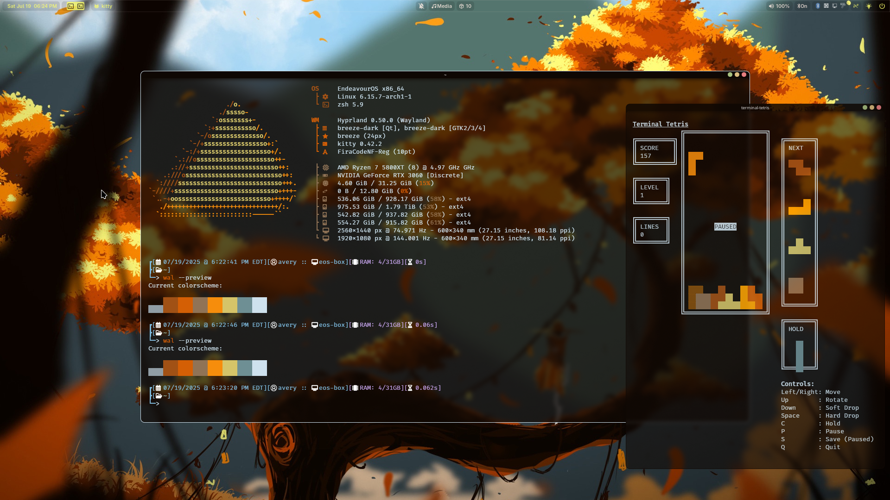
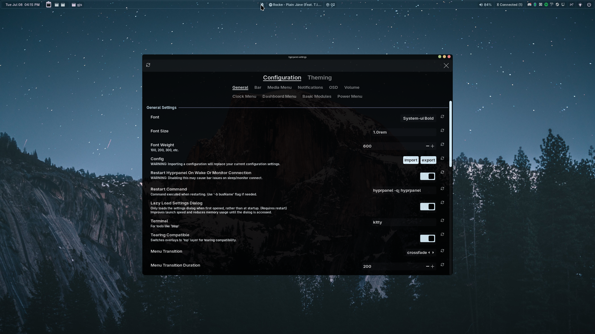
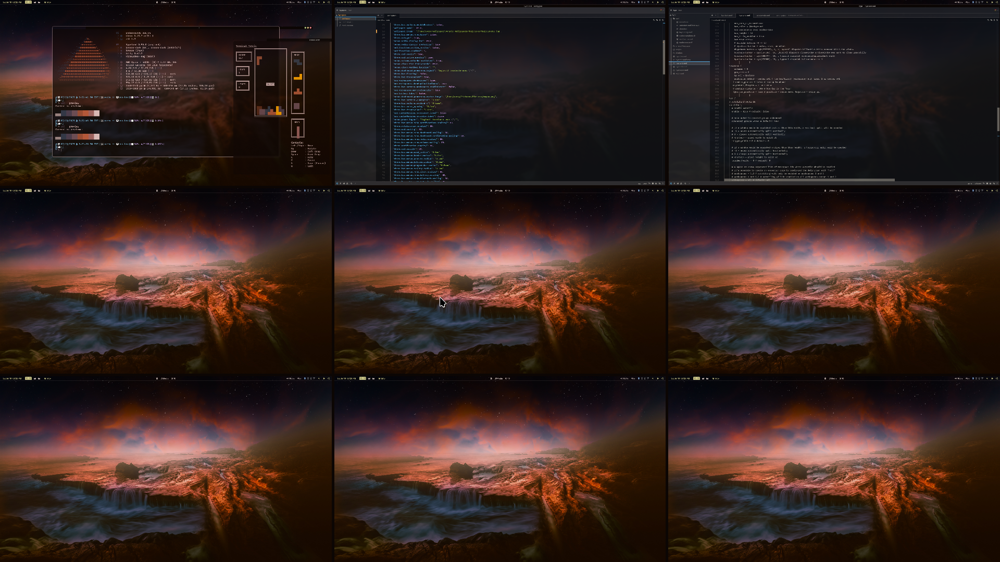

Dotfiles

This repository contains my personal dotfiles, which are configuration files used to customize various aspects of my Linux environment. These aren't world-changing, but they serve as a consistent setup across my systems.

Note: These dotfiles originally started off as the ml4w dots but have since significantly morphed into their own distinct configuration.

What's Included:# Avery's Dotfiles

My personal collection of configuration files for a cohesive and customized Linux experience on Hyprland.






---

## About This Setup

This repository contains my personal dotfiles. They are primarily built for a setup using the [Hyprland](https://hyprland.org/) Wayland compositor. The configuration aims for a clean, functional, and aesthetically pleasing desktop environment.

These dotfiles began as a fork of the [ml4w dots](https://github.com/ml4w) but have since been heavily modified to suit my own workflow and preferences.

## What's Included

This configuration manages the setup for the following applications:

* **Window Manager**:
    * [**Hyprland**](https://hyprland.org/): The core Wayland compositor.
    * [**HyprPanel**](https://hyprpanel.com/): The main status bar and panel.
    * [**AGS (A Gtk System)**](https://github.com/Aylur/ags): Used for various widgets like the sidebar and calendar.

* **Terminals**:
    * [**Alacritty**](https://alacritty.org/): A fast, GPU-accelerated terminal emulator.
    * [**Kitty**](https://sw.kovidgoyal.net/kitty/): Another feature-rich terminal emulator.

* **Application Launchers & Theming**:
    * [**Rofi**](https://github.com/davatorium/rofi): Used as an application launcher and window switcher.
    * [**Pywal**](https://github.com/dylanaraps/pywal): Generates and applies color schemes based on the current wallpaper.
    * **GTK 3 & 4 / Qt5 & Qt6**: Theming for graphical applications.

* **Shell & Tools**:
    * [**Oh My Posh**](https://ohmyposh.dev/): Provides custom, themeable shell prompts.
    * [**Yazi**](https://github.com/sxyazi/yazi): A terminal file manager.
    * [**Micro**](https://micro-editor.github.io/): A modern terminal-based text editor.

## Installation

1.  **Clone the repository:**
    ```bash
    git clone [https://github.com/your-username/dotfiles.git](https://github.com/your-username/dotfiles.git) ~/.dotfiles
    ```

2.  **Backup your existing configs:**
    If you have existing configurations for the applications listed above, make sure to back them up first.

3.  **Symlink the files:**
    The simplest way to install these dotfiles is to symbolically link them from the cloned repository to your `~/.config` directory.
    ```bash
    # Example for alacritty
    ln -s ~/.dotfiles/.config/alacritty ~/.config/alacritty

    # Example for hypr
    ln -s ~/.dotfiles/.config/hypr ~/.config/hypr
    ```
    You can create a script to automate this for all the required directories.

## Core Dependencies

To use these dotfiles, you will need to have the following software installed:

* **Hyprland** (and its dependencies)
* **AGS**
* **HyprPanel**
* **Alacritty**
* **Rofi**
* **Pywal**
* A Nerd Font (e.g., JetBrainsMono Nerd Font) for icons to display correctly.

Please refer to the documentation of each respective project for installation instructions specific to your distribution.


These dotfiles primarily configure:

    ags: Configuration for the AGS (A Gtk System) widgets, including custom GTK-based widgets for system monitoring, a sidebar, and a calendar. This is also used as the foundation for HyprPanel.

    alacritty: Settings for the Alacritty terminal emulator, including color schemes and keybindings.

electron: Flags for running Electron applications.

gtk-3.0 and gtk-4.0: Theming and appearance settings for GTK applications.

hypr: Configuration for the Hyprland Wayland compositor, including custom keybindings, window rules, animations, and general behavior. This also contains scripts for managing power, wallpapers, and other system interactions.

hyprpanel: A highly customizable panel built for Hyprland that provides useful widgets for displaying system information (volume, network, bluetooth, etc.) and quick access to system settings.

kitty: Configuration for the Kitty terminal emulator, including color schemes.

MangoHud: Overlay settings for monitoring game performance.

micro: Bindings for the micro text editor.

ohmyposh: Custom prompt themes for the shell.

pacseek: Configuration for the Arch Linux package management TUI, including color schemes.

qt5ct and qt6ct: Theming settings for Qt applications.

rofi: Theming and setup for the Rofi application launcher and switcher.

systemd: Adjustments to system and service management.

Trolltech.conf: Qt configuration file.

Vial: Configuration related to keyboard firmware.

wal: Templates for pywal, a tool that generates color schemes from images.

    xsettingsd: Configuration for the xsettingsd daemon.

    yazi: Settings for the yazi command-line file manager.

This collection aims to provide a cohesive and personalized user experience.
